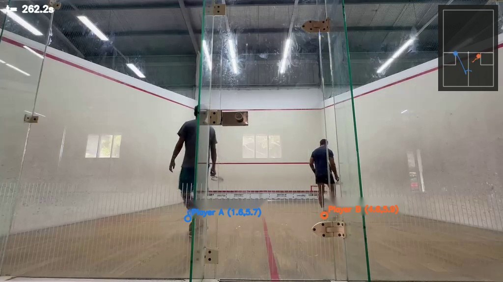
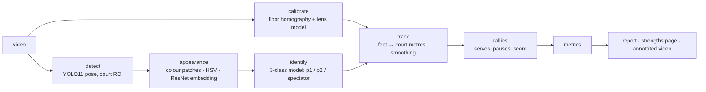
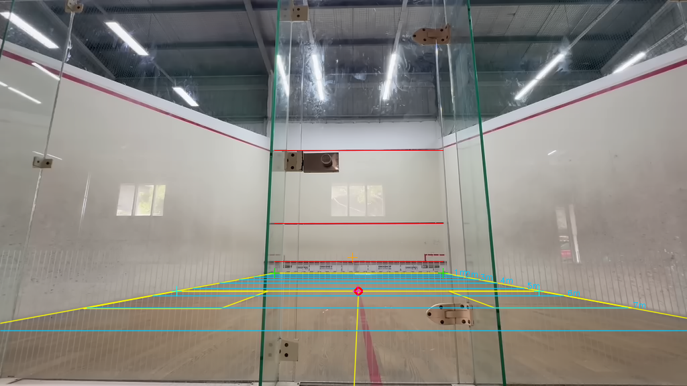
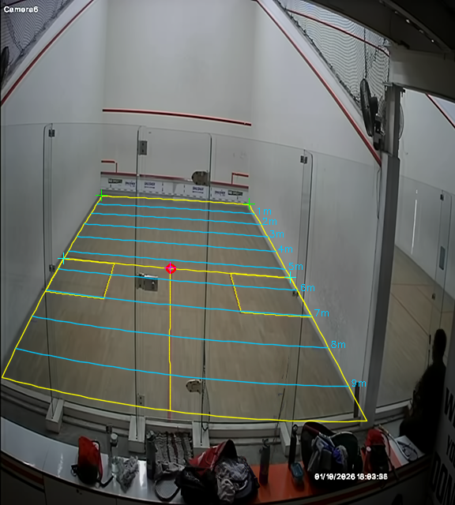
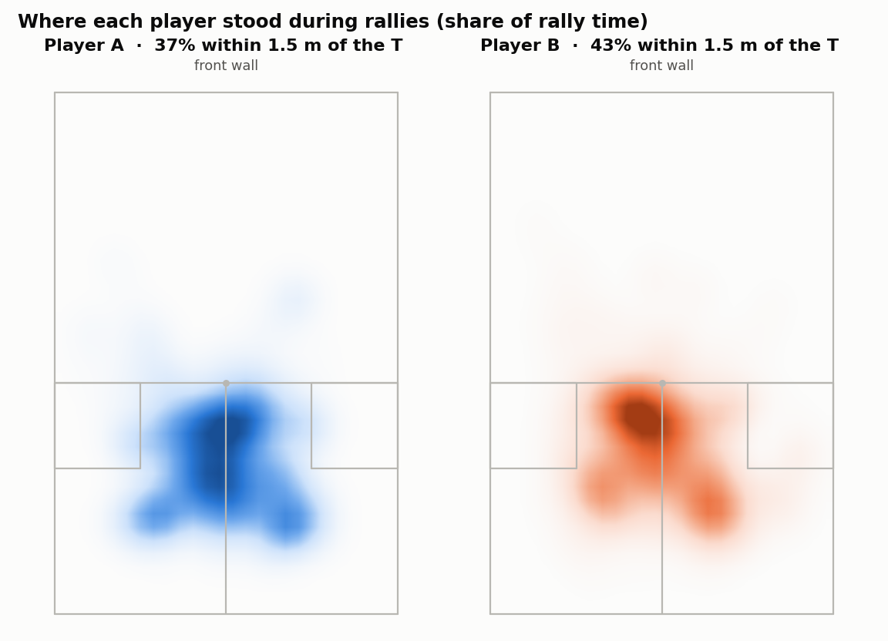
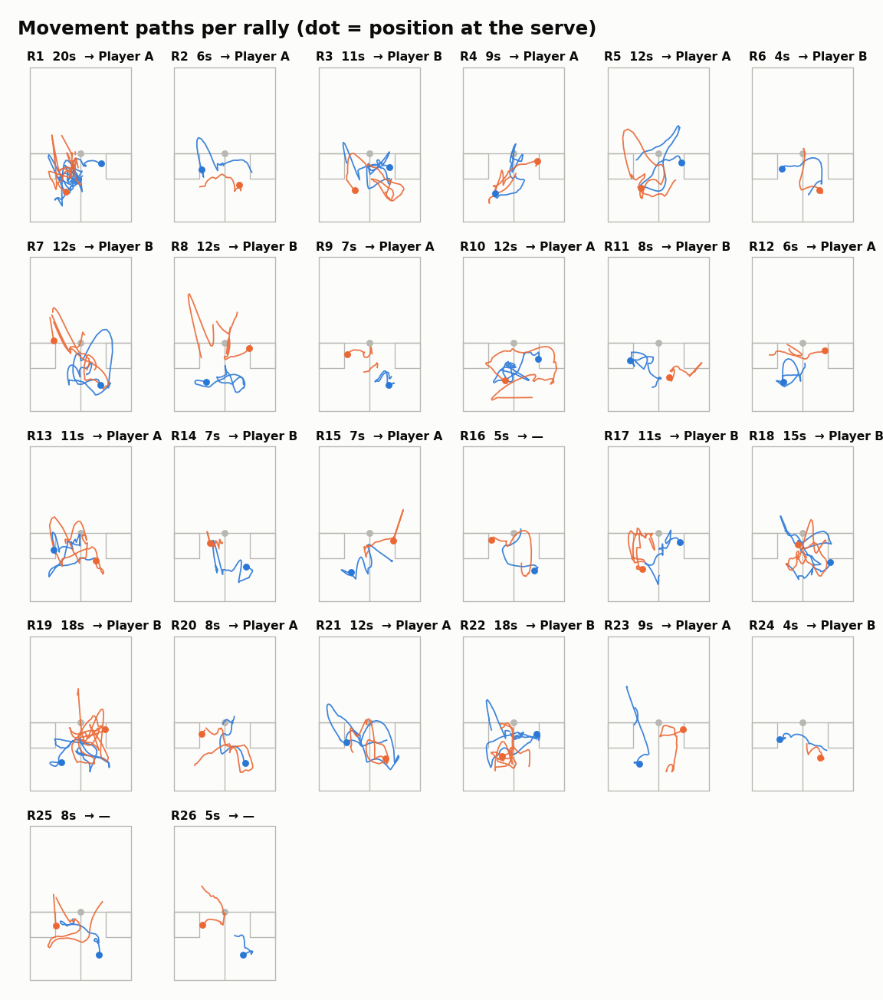
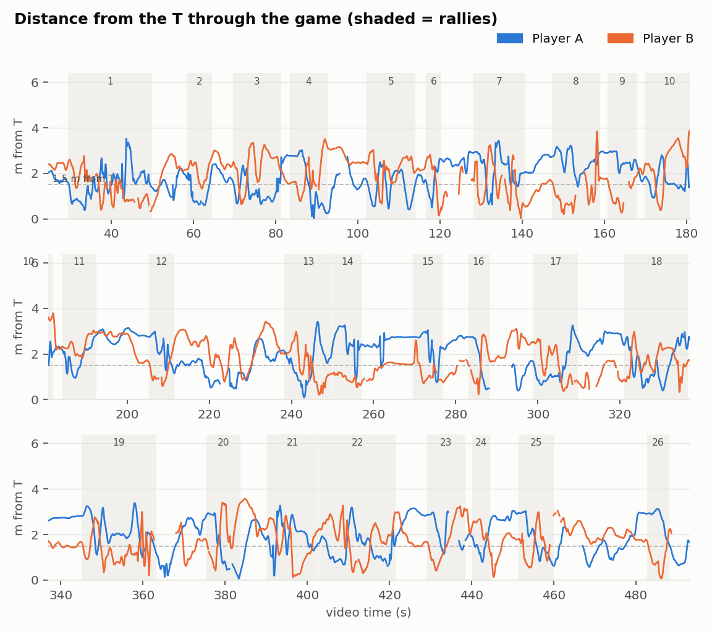
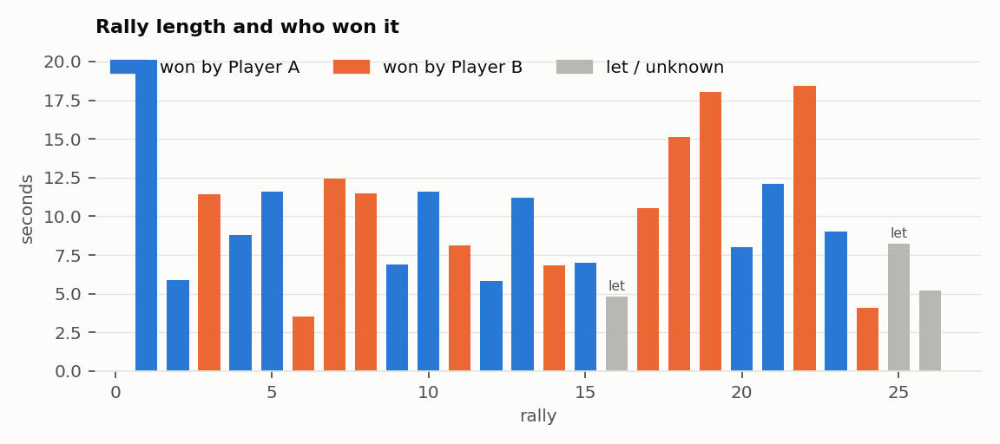
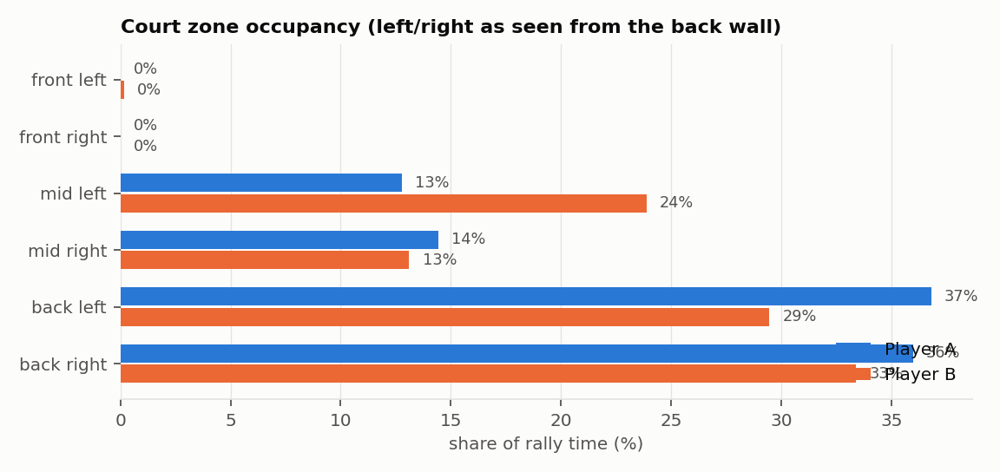

# Smashers — squash match analysis from one fixed camera

[](https://github.com/dakshinsiva/smashers/actions/workflows/ci.yml)


Point a phone or a CCTV camera at a squash court, record a game, and get back where each player stood,
how they moved, who controlled the T, every rally with its server and winner, the reconstructed score,
a coach-facing report and an annotated video. No wearables, no multi-camera rig, no ball tracking, and
no manual tagging beyond labelling a few seconds of each player.



*Every frame: both players detected, their foot positions projected onto the court (the numbers are metres
across and from the front wall), a top-down mini-map with recent movement, and the reconstructed score.*

## Why this is hard

A single camera behind the glass back wall sees the court from a low or oddly high angle, through a
wide lens that bends straight lines, with the players' reflections in the glass, a neighbouring court in
the corner of the frame and spectators standing at the door. Both players wear dark kit. The ball is a
few pixels across. Nothing in the picture says who won a point.

The pipeline deals with each of those explicitly, and the two human checks it needs (is the calibration
right, who is who) take a minute each.

## Pipeline



| Stage | What happens | Output |
|---|---|---|
| **Calibrate** | Builds a player-free background, finds the painted lines, fits a floor homography (plus a one-parameter radial lens model for wide lenses) so pixels map to court metres | `calibration.json`, an overlay for a human check |
| **Detect** | YOLO11 pose on every sampled frame inside a court ROI; people outside the court are blanked before inference | boxes + 17 keypoints per person |
| **Identify** | A few of the longest tracklets are labelled by hand from montages; colour patches at the chest and thighs, HSV histograms and a ResNet-18 embedding train a 3-class logistic model (player, player, spectator) | per-detection identity (93–97 % under grouped cross-validation) |
| **Track** | Continuity tracklets, foot-on-floor estimate (shoe sole, not ankle), projection to the court, Savitzky–Golay smoothing | `positions.csv` at 10–12 Hz |
| **Rallies** | Serve configurations (server in the box, receiver behind), pause detection, quick-serve inference; the score follows from the point-a-rally serving rule and is checked against the serve-box alternation rule | `rallies.csv`: server, box, winner, running score, notes |
| **Metrics & report** | T control, recovery time, zones, distance, speed, serve/return, rally-by-rally, findings written as coaching points with the evidence and one action each | HTML + PDF report, a strengths page, an MP4 with scoreboard and mini-map |

## Calibration

The floor homography is fitted from what the camera can actually see, and the overlay is meant to be
looked at before anything else runs. On a floor-level phone that is the front-wall lines, the side-wall
floor junctions and the far end of the half-court line. On an elevated CCTV camera it is the painted
floor lines themselves: a black-hat filter isolates them, each one is traced, and a homography and a
radial lens term are fitted jointly so every traced pixel lands on its known court line.

| Floor-level phone (Court 1) | Elevated CCTV with barrel distortion (Court 2) |
|---|---|
|  |  |

*Yellow: the court model reprojected (short line, service boxes, half-court line). Cyan: one-metre depth
steps. On Court 2 the traced lines fit within 2–3 cm and the T within 3 cm.*

## What comes out

| Where each player stood during rallies | One small court per rally: both paths, dot at the serve |
|---|---|
|  |  |

| Distance from the T through the game | Rally length and who won it |
|---|---|
|  |  |



The report turns the numbers into findings a coach can act on, each with its evidence and one thing to
do. From the two games analysed so far: *the receiver won 18 of 20 decided points*; *one player had the
T in only 2 of 20 rallies and still won half the points, by running*; *neither player spent more than
1 % of rally time in the front third*; *median recovery to the T 1.2 s against 2.2 s*.

## Running it

```bash
python3 -m venv .venv && .venv/bin/pip install -e ".[dev]"
cp games/example_game.yaml games/my_game.yaml      # video path, players, dates, which court
python run_all.py games/my_game.yaml
```

A game file names a **court profile** (`courts/*.yaml`): camera type, detection ROI and calibration
windows for that fixed camera. Set it up once per court; after that a new game is a video path and two
player names. The stages are cached, so re-running after a changed label or threshold takes seconds
rather than the 15 minutes the detector needs:

```bash
python run_all.py games/my_game.yaml --force-from rallies   # re-run from rally segmentation
python run_all.py games/my_game.yaml --no-video              # skip the annotated MP4
python -m squash.calibrate --force                           # any single stage (SMASHERS_CONFIG=games/my_game.yaml)
```

The two human checks: look at `output*/calibration_overlay.png` before running the rest, and label the
longest tracklets from the montages into `output*/tracklet_labels.json` (keys `p1`, `p2`, and `other` for
anyone on screen who is not playing).

## Design notes

- **Court frame.** Origin at the front-left floor corner seen from the back wall; x across (0–6.4 m), y from
  the front wall (0) to the back wall (9.75 m); the T is (3.2, 5.44). `squash/court.py` holds the model.
- **Feet, not ankles.** From a low camera the ankle keypoint sits 8 cm above the floor, which near the T is
  half a metre of depth. The bounding-box bottom (the shoe sole) is used instead, with a height-corrected
  ankle only when the feet leave the frame.
- **Identity is learned per game.** Kit colours differ, lighting differs and video compression shifts hues,
  so no fixed colour rule survives two games. A small supervised model on cheap descriptors does, and a
  third class removes spectators instead of forcing them onto a player.
- **Score without the ball.** In point-a-rally scoring the winner of a rally serves the next one, so the
  score follows from who serves. A server who keeps serving must alternate boxes; the share of rallies
  where that held is reported with every game as the internal consistency check.
- **Pace-adaptive segmentation.** Pause and serve thresholds come from percentiles of the game's own
  activity signal, with the few judgement calls (where the receiver waits, how long a serve stance lasts)
  exposed as named per-game parameters rather than buried constants.

## Validation

- Calibration: traced floor lines fit within 2–3 cm rms on the CCTV court; corners within 10 cm.
- Identity: 93 % (two classes, phone footage) and 97 % (three classes, CCTV) per-detection accuracy under
  grouped cross-validation, 99–100 % per tracklet; checked by eye on stills across each game.
- Serves: on the CCTV game the detected server matched the video in 11 of 12 rally starts checked.
- Score: the serve-box alternation check held in every applicable case in both games.

## Repository layout

```
squash/           the pipeline, one module per stage (python -m squash.<stage> runs one alone)
courts/           court/camera profiles: ROI and calibration windows
games/            per-game configs (template committed; real games are ignored because they name people)
tests/            court model, calibration maths, score reconstruction
docs/images/      the sample outputs shown above
run_all.py        runs the stages for one game, skipping cached ones
```

## Limitations

No ball tracking, so shot selection, errors, and lets or strokes decided by the players are invisible.
Position accuracy is about 10 cm over the playing area and worse in the far corners of a wide lens. A
"let" is inferred as the same server serving twice from the same box, which cannot be told apart from a
missed rally. Footage may not contain the whole game; the reports say so rather than guess.

## Licence

MIT.
